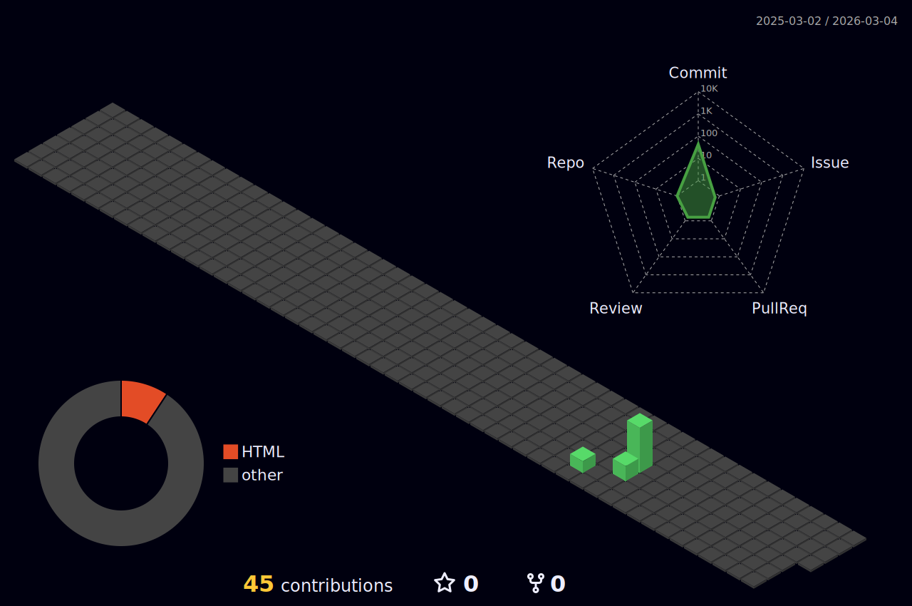

  

  

  

 

  

 

### 👨‍💻 About Me
I'm a Developer based in India, passionate about building accessible web apps and backend systems.

- 🔭 I’m currently working on **[Your Project Name]**
- 🌱 I’m currently learning **Advanced System Design**
- 👯 I’m looking to collaborate on **Open Source Projects**
- 💬 Ask me about **React, Node.js, and Cloud Architecture**
- ⚡ Fun fact: **I code faster than I can talk.**

  
  
  

 

### 🛠️ Tech Stack

  
  
  
  
  
  
  
  

 

### 💻 My Gear
| Category | Device / Tool |
| :--- | :--- |
| **OS** | Windows 11 / Linux |
| **Code Editor** | VS Code (Tokyo Night Theme) |
| **Terminal** | PowerShell + Oh My Posh |
| **Hardware** | Ryzen 7 / 16GB RAM |

 

### 📈 Coding Activity

  

 

### 📊 Statistics

  

 

  
  
  

 

### 🏆 Featured Projects
| Project | Description | Stack | Links |
| :--- | :--- | :--- | :--- |
| **Project Name 1** | A brief description of what this project does and the problem it solves. | `React` `Node` | [Repo](#) |
| **Project Name 2** | A brief description of what this project does and the problem it solves. | `Python` `AI` | [Repo](#) |
| **Project Name 3** | A brief description of what this project does and the problem it solves. | `Java` `Spring` | [Repo](#) |

 

### 🐍 Contribution History

  <picture>
    <source media="(prefers-color-scheme: dark)" srcset="https://raw.githubusercontent.com/Mr-Rock-249/Mr-Rock-249/output/github-contribution-grid-snake.svg">
    <source media="(prefers-color-scheme: light)" srcset="https://raw.githubusercontent.com/Mr-Rock-249/Mr-Rock-249/output/github-contribution-grid-snake.svg">
    
  </picture>

